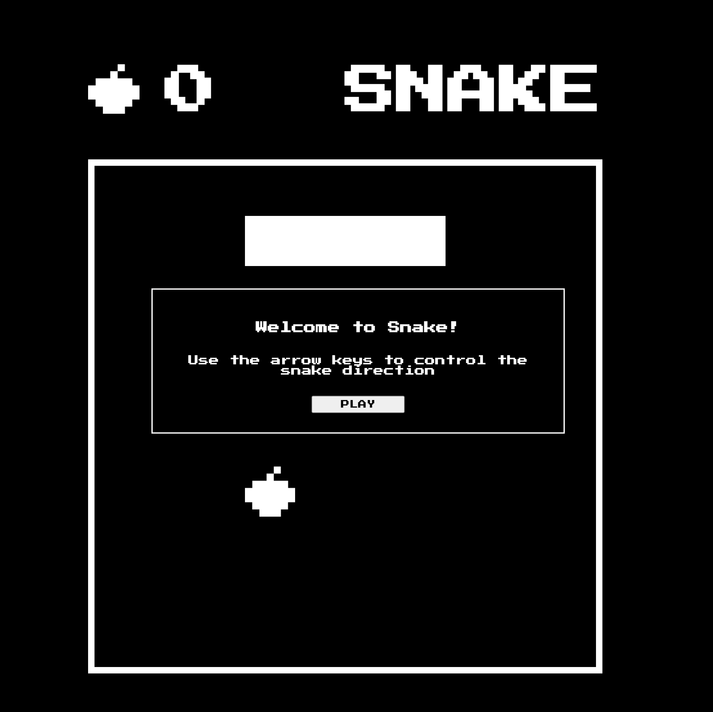

###  General Assembly, Software Engineering Immersive

# Project 1 - Snake



## Overview

This is my first project of the General Assembly Software Engineering course. I was tasked with creating a simple grid based game to render in browser utilising HTML, CSS and Javascript. This project was to be completed individually and we had 5 days to complete it. 

## Brief:
- Render a grid based game in the browser
- Include separate HTML / CSS / JavaScript files
- Stick with KISS (Keep It Simple Stupid) and DRY (Don't Repeat Yourself) principles
- Use Javascript for DOM manipulation
- Deploy your game online, where the rest of the world can access it
- Use semantic markup for HTML and CSS (adhere to best practices)
- For this project, we were required to select a game to build and a result, have altered requirements:
    - The snake should be able to eat food to grow bigger
    - The game should end when the snake hits the wall or itself
    - Snake speeds up as it eats more

You can check out the deployed project here: [Snake](https://nalderson.github.io/project-1/)

Technologies Used:
- HTML5
- CSS
- JavaScript (ES6)
- Git
- GitHub
- Google Fonts

## Approach taken:

### Grid layout:
I created my grid using javascript and creating an array of divs within a for loop. I then styled these accordingly in CSS. Using this method allowed me to easily keep track of the cell index, which was helpful when placing the snake (which I created as an array) and randomFruit (using Math.Random) on the grid. 

### Functionality:

## Defining Directions 
My priority in this project was to get the snake moving as I expected it to. To do that, I knew I had to add some event listeners and define the direction of the snake first. To do this I used a sequence of if else statements to check for which 'keydown' occured and therefore which direction the snake would then move in:

```
document.addEventListener('keydown', (event) => {
  if (event.keyCode === 37) {
    direction = 'left'
  }
  else if (event.keyCode === 38) {
    direction = 'up'
  }
  else if (event.keyCode === 39) {
    direction = 'right'
  }
  else if (event.keyCode === 40) {
    direction = 'down'
  }
})
```

## Game Interval / Snake Movement
To make the snake move in it's expected manner (i.e. all bodyparts shifting to the next cell in time as per the original game), I decided to store it as an array as then I could manipuate it's movement easily using a variety of array methods. 

I used the forEach method in order to loop through all snake bodyparts and remove the classlist of snake. I then used unShift in order to advance the head of the snake and pop() to remove the tail and then re add the snake class to it's bodyparts. 

````
   interval = setInterval((keyPress) => {
    gameOver()
    if (direction === 'left' && !(snake % width === 0)) {
      snake.forEach((bodyPart, index) => {
        cells[bodyPart].classList.remove('snake')
      })
      snake.unshift(snake[0] - 1)
      snake.pop()
      snake.forEach((bodyPart, index) => {
        cells[bodyPart].classList.add('snake')
      })
    }

````

## Snake Eats Fruit 
For this part of the project, I wanted to store the snake as an array so again it was easy to manipulate using the various array methods: 

Within the snake eats fruit function, I had x4 key functions which needed to be called when the snake Head was the same cell index as the Fruit:

- Increase the snake length 
- Another fruit needed to display on the board 
- The game interval speed needed to increase
- The number of fruit eaten needed to be updated 

For the snake to increase in length it was simply pushing an extra item into the array and adding the class of snake to it. The same with random fruit - using the Math.Random method and applying the fruit class to a random cell index. The same goes for updating the innerHTML on the display board. 

The updating interval speed was a little trickier as I had read a lot online that you cannot actually update an interval, so this was a little challenging to work out. To do this I realised you had to declare a speed GameSpeed variable outside of the function and interval itself. You were then able to clear the interval using it's specific interval ID and then adjust the game speed in order to update the interval:

`````
   function updateIntervalSpeed () {
    clearInterval(interval);
    gameSpeed -= 100
    startGame()
   }
`````

## Game Over Function 
For the Game Over function one of x2 things needed to happen in order for this to be called:
- The snake collides with the barrier 
- The snake tail or head collides with itself

These both were challenges for me, as it took me a while to play around with the barriers to get these right. Additionally, I wanted to allow the player to go to the edge of the board and then change direction without triggering the game over function. I managed this in the end by calling the GameOver function as the first item in my interval, so it would check for the game over parameters before the interval was then run. 

````
if ((snake[0] + width >= width ** 2 && direction === 'down') || (snake[0] % width === 0 && direction === 'left')|| (snake[0] < width && direction === 'up') || (snake[0] % width === width - 1 && direction === 'right')) {
    clearInterval(interval)
    document.querySelector(".game-over").style.display = "block"
    audioPlayer.src= "./sounds/game-over.mp3"
    audioPlayer.play()

  }
````

I thought the head or tail colliding with itself would be simple, but then I realised I needed to get all of the snake parts and their locations and check it against the head. So I ended up putting this in a filteredArray. This was definitely something I overlook in terms of planning. 


## CSS
I wanted to keep this super retro and style it like some of the first online video games. I used a retro arcade font I found online and tried to keep things super simple and clean and added some retro royalty free sounds I found on zapland. 

## Future Fixes
- Currently with game over part of the snake head is displayed on the line above or below on the opposite side of the board, so I would like to fix that at a later date 
- There is no restart button, which again I would like to fix at a later date 
- It's not mobile compatible. This wasn't a requirement but it would have been a nice to have and I'll do it in future


## Lessons Learned 
- I learnt how to make grid based game using Javascript 
- I learnt how to use JavaScript
- Planning is a very large part of game development, so the longer you spend doing that the easier it makes your coding 
